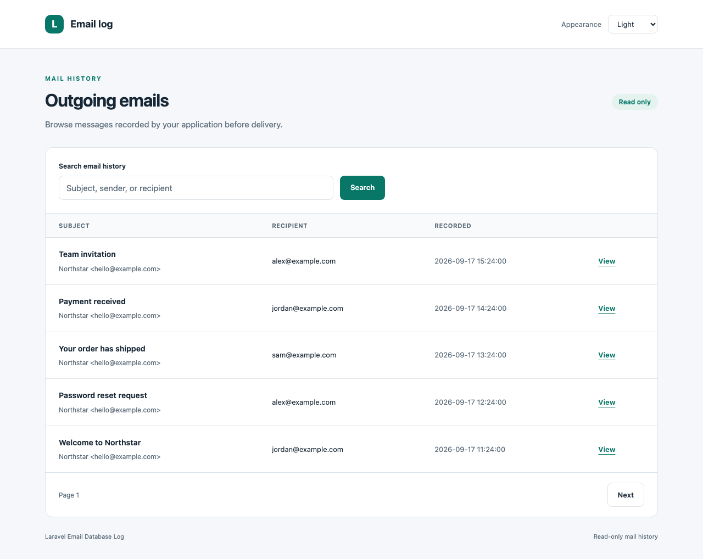

# Laravel Email Database Log

Record outgoing Laravel emails in your database. Keep logging on its own, or enable a read-only dashboard with light and dark themes.

[](https://github.com/jeremykenedy/laravel-email-database-log/actions/workflows/master.yml)
[](https://packagist.org/packages/jeremykenedy/laravel-email-database-log)
[](LICENSE.md)

<picture>
  <source media="(prefers-color-scheme: dark)" srcset="art/dashboard-dark.png">
  <source media="(prefers-color-scheme: light)" srcset="art/dashboard-light.png">
  
</picture>

## Requirements

PHP 8.0 or later, with the PHP version required by your Laravel release:

| Laravel | PHP tested in CI | Mail implementation |
| --- | --- | --- |
| 8 | 8.0, 8.1 | SwiftMailer |
| 9 | 8.0, 8.1, 8.2 | Symfony Mailer |
| 10 | 8.1, 8.2, 8.3 | Symfony Mailer |
| 11 | 8.2, 8.3, 8.4 | Symfony Mailer |
| 12 | 8.2, 8.3, 8.4, 8.5 | Symfony Mailer |
| 13 | 8.3, 8.4, 8.5 | Symfony Mailer |

Compatibility with older releases does not extend their upstream security support. This release does not support Laravel 5 through 7; the previous README overstated support beyond the Composer constraints.

## Installation

```bash
composer require jeremykenedy/laravel-email-database-log
php artisan email-log:install
php artisan migrate
```

Laravel discovers the service provider automatically. The installer offers `none` (logging only), `standalone`, `bootstrap5`, and `tailwind`. It publishes the existing migration but does not run it. For unattended installation with the original behavior:

```bash
php artisan email-log:install --no-interaction
php artisan migrate
```

The original installation method remains available:

```bash
php artisan vendor:publish --tag=laravel-email-database-log-migration
php artisan migrate
```

## Existing applications

**Composer updates keep logging-only behavior.** There was no GUI or frontend framework in earlier releases. Updating this package does not enable routes, run migrations, replace views, or install frontend dependencies.

The `email_log` table, migration filename, migration publish tag, event listener, public logger methods, and existing Symfony mail storage format are retained. No database migration is needed for the dashboard. Read the [upgrade guide](docs/upgrading.md) before changing a customized installation.

## Dashboard

```bash
php artisan email-log:install --framework=standalone
```

Define authorization in your application's service provider before visiting `/email-log`:

```php
use Illuminate\Support\Facades\Gate;

Gate::define('viewEmailLog', function ($user) {
    return $user->is_admin;
});
```

Use your application's actual admin permission in place of `is_admin`. Authentication alone does not grant access. The dashboard denies all users until the gate allows them.

The dashboard provides search by subject, sender, or recipient; pagination; message details; and light, dark, or system appearance. Email bodies, headers, and attachments are displayed as escaped source. It has no resend, delete, or download actions.

### Frameworks and views

| Option | Behavior |
| --- | --- |
| `none` | Logging only; dashboard disabled. Default for existing applications and unattended installs. |
| `standalone` | Blade dashboard with included CSS and JavaScript. No build step. |
| `bootstrap5` | Blade dashboard with Bootstrap 5 classes and `data-bs-theme` support. Supply your compiled Bootstrap CSS. |
| `tailwind` | Blade dashboard with Tailwind utilities and the `dark` class. Supply your compiled Tailwind CSS. |

```bash
php artisan email-log:update --framework=bootstrap5
php artisan email-log:update --framework=tailwind --publish-views
php artisan email-log:update --framework=none
```

Frameworks use shared Blade views so customizations do not have to be copied across three templates. Published views are preserved unless `--force-views` is explicitly supplied. See [dashboard configuration](docs/dashboard.md) for CSS setup, dark mode, view overrides, routing, and authorization.

### Optional packages

[Laravel UI Kit](https://github.com/jeremykenedy/laravel-ui-kit) can render the dashboard's delivery notice through its Blade alert component. It is not required for logging, styling, or dark mode.

```bash
composer require jeremykenedy/laravel-ui-kit
php artisan email-log:update --framework=bootstrap5 --ui-kit
```

Configure UI Kit's CSS framework to match your stylesheet. Its own PHP and Laravel requirements apply. Both setup commands offer this integration; neither runs Composer or changes UI Kit's settings. Disable it with `--without-ui-kit`.

[Laravel Toast](https://github.com/jeremykenedy/laravel-toast), [Laravel Darkmode Toggle](https://github.com/jeremykenedy/laravel-darkmode-toggle), [Laravel IP Capture](https://github.com/jeremykenedy/laravel-ip-capture), and [Laravel Seedster](https://github.com/jeremykenedy/laravel-seedster) remain optional application choices. The dashboard needs no toast notifications, IP capture, or generated seeders. Its built-in appearance selector works without another package. Custom published views may use the application's own components.

## Logging behavior

Every `MessageSending` event records a row in `email_log`, including queued mail when the worker sends it. A row records a sending attempt, not confirmed delivery. Failed transports can leave a log entry. Database errors continue to propagate to the sender, matching existing behavior.

The table stores addresses, subject, body, headers, and MIME attachment source. Symfony multipart bodies retain their existing MIME representation. SwiftMailer uses its message body and attachment representation. Mail sent outside Laravel's mail events is not recorded. `Mail::fake()` does not send mail and therefore does not exercise this logger.

Retention, backups, encryption at rest, and access to logged mail remain application responsibilities. Logs can contain password reset links, personal information, and attachment content. The dashboard uses the application's default database connection and is not a per-user or tenant filter.

## Development

```bash
composer install
composer check
composer test-coverage
```

Coverage requires Xdebug or PCOV. Browser checks use a disposable Testbench application and sample mail:

```bash
npm ci
npx playwright install chromium
npm run lint
npm test
```

See [testing](docs/testing.md) for the compatibility matrix, accessibility checks, and screenshot updates. See [CHANGELOG.md](CHANGELOG.md) for changes.

## License

[MIT](LICENSE.md), copyright 2023-2026 Jeremy Kenedy and contributors.
