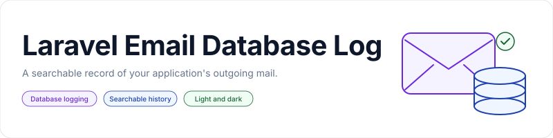

<p align="center">
    <picture>
        <source media="(prefers-color-scheme: dark)" srcset="art/banner-dark.svg">
        <source media="(prefers-color-scheme: light)" srcset="art/banner-light.svg">
        
    </picture>
</p>

<p align="center">Record outgoing Laravel emails with an optional searchable dashboard and light and dark themes.</p>

<p align="center">
    <a href="https://packagist.org/packages/jeremykenedy/laravel-email-database-log"></a>
    <a href="https://packagist.org/packages/jeremykenedy/laravel-email-database-log"></a>
    <a href="https://github.com/jeremykenedy/laravel-email-database-log/actions/workflows/master.yml"></a>
    <a href="https://github.styleci.io/repos/606927458"></a>
    <a href="LICENSE"></a>
</p>

## Table of Contents

- [Framework Support](#framework-support)
- [Requirements](#requirements)
- [Installation](#installation)
- [Existing Applications](#existing-applications)
- [Quick Start](#quick-start)
- [Features](#features)
- [Configuration](#configuration)
- [Changing Frameworks](#changing-frameworks)
- [Update (Interactive)](#update-interactive)
- [Switch (Quick)](#switch-quick)
- [Artisan Commands](#artisan-commands)
- [Install Options](#install-options)
- [Optional Packages](#optional-packages)
- [Logging Behavior](#logging-behavior)
- [Testing](#testing)
- [License](#license)

## Framework Support

| Laravel | PHP tested in CI | Mail implementation |
| --- | --- | --- |
| 8 | 8.0, 8.1 | SwiftMailer |
| 9 | 8.0, 8.1, 8.2 | Symfony Mailer |
| 10 | 8.1, 8.2, 8.3 | Symfony Mailer |
| 11 | 8.2, 8.3, 8.4 | Symfony Mailer |
| 12 | 8.2, 8.3, 8.4, 8.5 | Symfony Mailer |
| 13 | 8.3, 8.4, 8.5 | Symfony Mailer |

Compatibility with older releases does not extend their upstream security support. Laravel 5 through 7 are outside this package's Composer constraints.

| Dashboard option | Views and assets |
| --- | --- |
| `none` | Logging only. Default for existing applications and unattended installs. |
| `standalone` | Blade views with included CSS and JavaScript. No build step. |
| `bootstrap5` | Shared Blade views with Bootstrap 5 classes. Supply compiled Bootstrap 5.3 CSS. |
| `tailwind` | Shared Blade views with Tailwind utilities. Supply compiled Tailwind 3 or 4 CSS. |

The dashboard uses Blade independently of the application's frontend. It does not install or replace Livewire, Vue, React, or Svelte views.

## Requirements

PHP 8.0 or later and the PHP version required by your Laravel release. Use Laravel's configured database connection and run the package migration for new installations. No Node dependencies are needed for logging or the standalone dashboard.

## Installation

```bash
composer require jeremykenedy/laravel-email-database-log
php artisan email-log:install
php artisan migrate
```

Laravel discovers the service provider automatically. The installer offers logging only or an optional dashboard. It detects existing configuration and migrations ending in `_create_email_log.php`, preserves them, and never runs migrations itself. If you renamed the migration to a different suffix, use `email-log:update` to configure the dashboard without publishing a migration.

For unattended installation with the original behavior:

```bash
php artisan email-log:install --no-interaction
php artisan migrate
```

The original installation method remains available:

```bash
php artisan vendor:publish --tag=laravel-email-database-log-migration
php artisan migrate
```

## Existing Applications

**Composer updates keep logging-only behavior.** Earlier releases had no GUI or frontend framework. Updating this package does not enable routes, run migrations, replace views, or install frontend dependencies. An explicitly enabled dashboard keeps its selected framework.

The `email_log` table, migration, publish tag, event listener, public logger methods, and Symfony mail storage format are retained. No database migration is needed for the dashboard. Read the [upgrade guide](docs/upgrading.md) before changing a customized installation.

## Quick Start

Laravel mail events are logged automatically:

```php
use Illuminate\Support\Facades\Mail;

Mail::raw('Your report is ready.', function ($message) {
    $message->to('reader@example.com')->subject('Report ready');
});
```

To browse recorded mail:

```bash
php artisan email-log:install --framework=standalone
```

Define authorization in your application's service provider before visiting `/email-log`:

```php
use Illuminate\Support\Facades\Gate;

Gate::define('viewEmailLog', function ($user) {
    return $user->is_admin;
});
```

Replace `is_admin` with your application's administrator permission. Authentication alone does not grant access. The dashboard denies all users until the gate allows them. Link to it from an authorized Blade navigation item:

```blade
@can('viewEmailLog')
    <a href="{{ route('email-log.index') }}">Email history</a>
@endcan
```

<picture>
    <source media="(prefers-color-scheme: dark)" srcset="art/dashboard-dark.png">
    <source media="(prefers-color-scheme: light)" srcset="art/dashboard-light.png">
    
</picture>

## Features

- Records outgoing mail, including queued mail when the worker sends it.
- Optional read-only history with subject, sender, and recipient search.
- Paginated results and escaped message, header, and attachment source.
- Standalone, Bootstrap 5, or Tailwind styling with shared Blade views.
- Light, dark, and system appearance with a saved browser preference.
- Authentication and an application-defined gate on every dashboard page.
- Safe setup commands that preserve application configuration and view overrides.

## Configuration

`config/laravel-email-database-log.php` contains application-owned settings. Setup commands create this file if missing and never overwrite it.

| Option | Default | Purpose |
| --- | --- | --- |
| `path` | `email-log` | Dashboard URL prefix. |
| `middleware` | `['web', 'auth']` | Application middleware and authentication guard. |
| `gate` | `viewEmailLog` | Permission required for all dashboard pages. |
| `per_page` | `25` | Page size, bounded to 1 through 100. |
| `theme` | `system` | Initial appearance: `light`, `dark`, or `system`. |
| `stylesheet` | `null` | URL of the application's compiled framework CSS. |

`config/laravel-email-database-log-ui.php` stores setup selections:

| Option | Default | Purpose |
| --- | --- | --- |
| `enabled` | `false` | Register dashboard routes. |
| `framework` | `standalone` | Styling to use when enabled. |
| `ui_kit` | `false` | Use a separately installed Laravel UI Kit alert. |

See [dashboard configuration](docs/dashboard.md) for CSS builds, dark mode, routing, authorization, view overrides, and publish tags.

## Changing Frameworks

All styles use the same Blade views. Switching preserves published view overrides and application-owned configuration. Commands refresh package assets in `public/vendor/email-log` and clear configuration, route, and view caches. Rebuild your deployment caches afterward.

### Update (Interactive)

```bash
php artisan email-log:update
php artisan email-log:update --framework=bootstrap5
```

| Option | Values | Effect |
| --- | --- | --- |
| `--framework` | `none`, `standalone`, `bootstrap5`, `tailwind` | Select dashboard styling or disable it. Omit for an interactive menu. |
| `--publish-views` | Flag | Publish missing views without replacing overrides. |
| `--force-views` | Flag | Replace published package views after backing up customizations. |
| `--ui-kit` / `--without-ui-kit` | Flags | Enable or disable the optional integration. |
| `--no-interaction` | Flag | Retain selections unless explicit options are supplied. |

### Switch (Quick)

```bash
php artisan email-log:switch --framework=bootstrap5
php artisan email-log:switch --framework=tailwind
php artisan email-log:switch --framework=none
```

| Option | Values | Effect |
| --- | --- | --- |
| `--framework` | `none`, `standalone`, `bootstrap5`, `tailwind` | Required. Change styling without a prompt. |
| Other options | Same as update | Preserve the same configuration and view safeguards. |

When switching to Bootstrap or Tailwind, set `stylesheet` to the compiled CSS URL and run `npm run build` in your application. Include package views in Tailwind's content sources as described in the [CSS setup guide](docs/dashboard.md#tailwind). Standalone styling needs no build.

## Artisan Commands

| Command | Description | Options |
| --- | --- | --- |
| `email-log:install` | Detect existing files, publish the original migration when missing, and optionally configure a dashboard. | Install options below. |
| `email-log:update` | Refresh assets and optionally change styling or views. Does not publish migrations. | Same options as install. |
| `email-log:switch` | Change styling using an explicit framework. | Same options, with `--framework` required. |

### Install Options

| Flag | Description |
| --- | --- |
| `--framework=` | `none`, `standalone`, `bootstrap5`, or `tailwind`. |
| `--ui-kit` | Use the separately installed Laravel UI Kit. |
| `--without-ui-kit` | Disable that integration. |
| `--publish-views` | Copy missing Blade views without overwriting customized views. |
| `--force-views` | Replace published package views. |
| `--no-interaction` | Keep current selections without prompts. Defaults to logging only on a fresh install. |

The package provides Blade views only, so it has no separate `--frontend` selection. `--framework` selects CSS; `--force-views` limits replacement to views. No command installs dependencies, runs migrations, or rewrites application layouts.

## Optional Packages

[Laravel UI Kit](https://github.com/jeremykenedy/laravel-ui-kit) can render the dashboard's delivery notice through its Blade alert component. It is not required for logging, styling, or dark mode.

```bash
composer require jeremykenedy/laravel-ui-kit
php artisan email-log:update --framework=bootstrap5 --ui-kit
```

Configure UI Kit's CSS framework to match your stylesheet. Its own PHP and Laravel requirements apply. Setup commands offer the integration but do not run Composer or change UI Kit settings. Disable it with `--without-ui-kit`.

[Laravel Toast](https://github.com/jeremykenedy/laravel-toast), [Laravel Darkmode Toggle](https://github.com/jeremykenedy/laravel-darkmode-toggle), [Laravel IP Capture](https://github.com/jeremykenedy/laravel-ip-capture), and [Laravel Seedster](https://github.com/jeremykenedy/laravel-seedster) remain optional application choices. The dashboard has no actions requiring notifications, IP capture, or seeders, and its appearance selector works without another package. Published views can use your application's components.

## Logging Behavior

Every `MessageSending` event records a row in `email_log`, including queued mail when the worker sends it. A row records a sending attempt, not confirmed delivery. Failed transports can leave a log entry. Database errors continue to propagate to the sender, matching existing behavior.

The table stores addresses, subject, body, headers, and MIME attachment source. Symfony multipart bodies retain their existing MIME representation. SwiftMailer uses its message body and attachment representation. Mail sent outside Laravel's mail events is not recorded. `Mail::fake()` does not send mail and therefore does not exercise this logger.

Retention, backups, encryption at rest, and access to logged mail remain application responsibilities. Logs can contain password reset links, personal information, and attachments. The dashboard uses the default database connection and grants access to the whole log, without per-user or tenant filtering. Existing database column limits remain unchanged.

## Testing

```bash
composer install
composer check
composer test-coverage
```

Coverage requires Xdebug or PCOV. Browser checks use a disposable Testbench application and sample mail:

```bash
npm ci
npx playwright install chromium
npm run lint
npm test
```

CI covers Laravel 8 through 13, PHP 8.0 through 8.5, lowest dependencies, Windows, SQLite, MySQL, PostgreSQL, the optional UI Kit, browser interactions, accessibility, linting, and dependency audits. See [testing](docs/testing.md) for details and [CHANGELOG.md](CHANGELOG.md) for changes.

## License

This package is open-sourced software licensed under the [MIT license](LICENSE).
